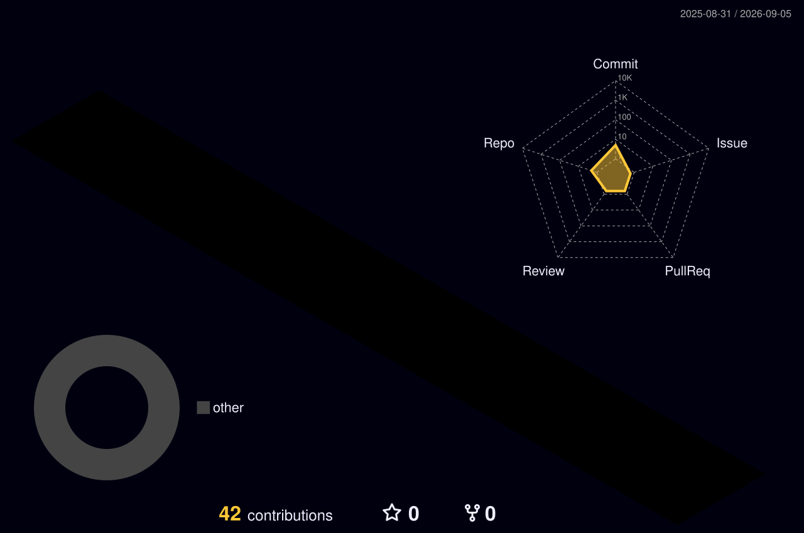

# voidvein

把想法写成代码，把代码打磨成可以长期运行的作品

## 关于我

你好，我是 `voidvein`。这里会记录我的项目实践、学习笔记和一些正在打磨的小工具。

- 关注能落地的工程实践，也喜欢研究有趣的技术细节。
- 习惯把学习过程沉淀成项目、文档或可复用工具。
- 希望持续写出更清晰、更稳定、更容易维护的代码。

## GitHub 修仙传

  

## 3D 贡献图

  

## 近期方向

- 整理个人项目，让零散想法逐步变成可维护的作品。
- 积累算法、工程实践和工具链相关的学习记录。
- 尝试用自动化和 AI 工具提升开发效率。

## 交流

- GitHub: [@voidvein](https://github.com/voidvein)

<!--
你可以继续补充：
- 精选项目链接
- 正在学习的技术
- 邮箱、博客、Bilibili、知乎等公开联系方式
- 更具体的个人介绍
-->
